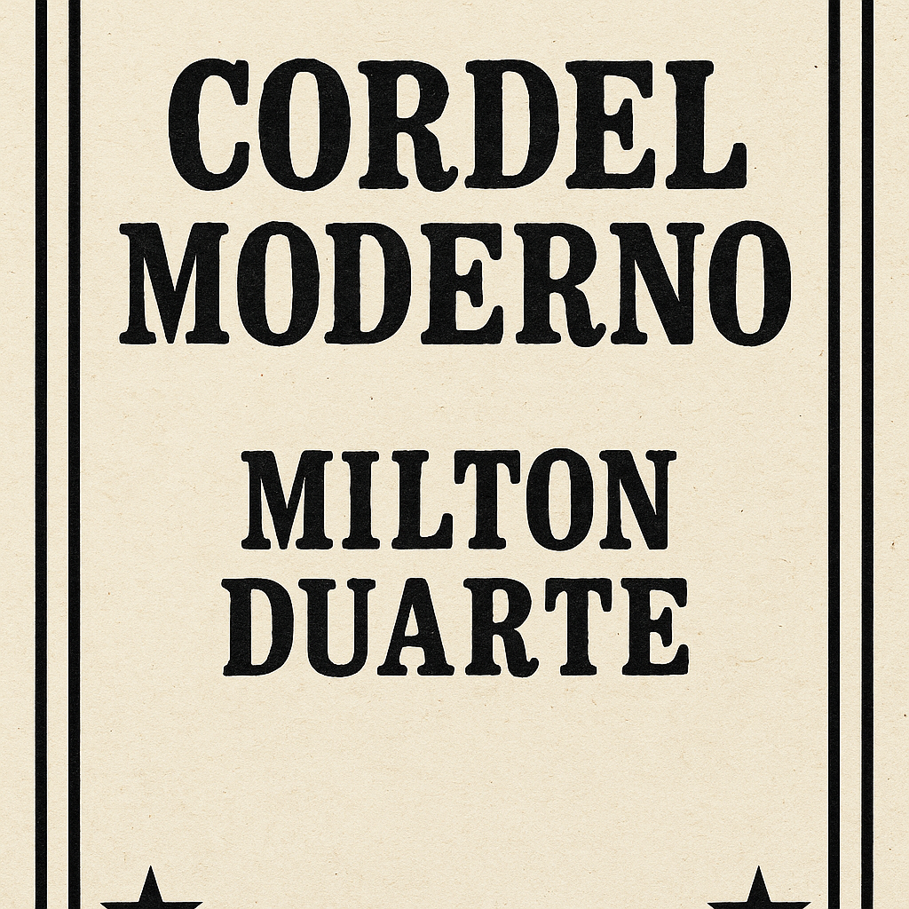

---
# 📜 Projeto Cordel – Milton Duarte

Página web inspirada no poema *“Cordel Moderno”* de **Milton Duarte**.  
Desenvolvido como parte do curso **HTML5 e CSS3** do *Curso em Vídeo* (prof. Gustavo Guanabara).  
Este projeto explora o uso de **tipografia, alinhamento de layout e design responsivo**, utilizando apenas **HTML5** e **CSS3**.

---

## 🌐 Visualizar o Projeto
🔗 [Acessar no GitHub Pages](https://ramiresdev.github.io/projeto-cordel/)  

---

## 🧠 Aprendizados Principais
- Aplicação de **HTML semântico** para melhor estruturação do conteúdo  
- Domínio de **tipografia e alinhamento visual**  
- Criação de um **layout responsivo de página única**  
- Uso de **imagens de fundo** e **sombras de texto** para reforçar a hierarquia visual  

---

## 🧰 Tecnologias Utilizadas
- **HTML5**  
- **CSS3**

---

## 🖼️ Prévia
  
*(Adicione aqui uma captura de tela do resultado final — pode ser a página completa ou um trecho que mostre o design.)*

---

## 🗂️ Status do Projeto
✅ Concluído – mantido como parte da minha trajetória de aprendizado em front-end.

---

## 👨‍💻 Autor
**Ramires Dev**  
💼 [GitHub](https://github.com/ramiresdev) 

---

> “Aprendendo a arte do design limpo e da estrutura semântica — uma linha de código por vez.”
